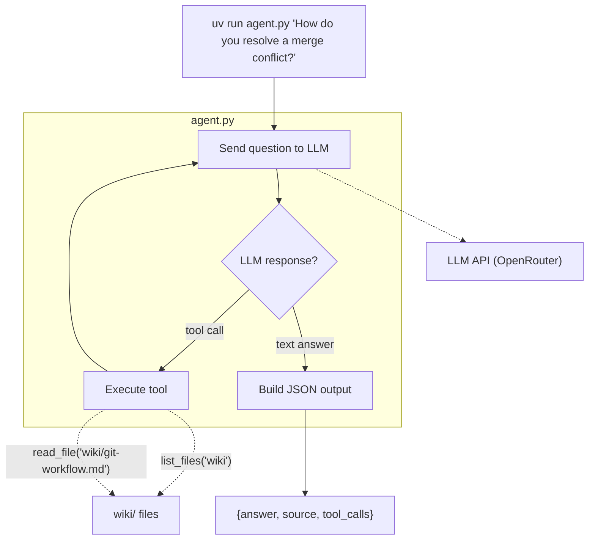

# The Documentation Agent

In Task 1 you built a CLI that calls an LLM — but it can only answer from the knowledge baked into its training data or your system prompt. It cannot look at your actual code or read your documentation. That is the difference between a chatbot and an **agent**: an agent has **tools** — functions it can call to interact with the real world, then reason about the results.

In this task you will give your agent two tools (`read_file`, `list_files`) and build the **agentic loop**: the LLM decides which tool to call, your code executes it, feeds the result back, and the LLM decides what to do next — call another tool or give the final answer. The agent will navigate the project wiki to answer questions.

## [Git workflow](../../../wiki/git-workflow.md)

1. Create an issue titled `[Task] The Documentation Agent`.
2. Pull latest `main` from `origin` and `upstream`.
3. Create a branch from `main` (e.g., `task/documentation-agent`).
4. Work on the branch. Commit as you go using [conventional commits](https://www.conventionalcommits.org/) (e.g., `feat:`, `docs:`, `test:`).
5. Push, create a PR to `main` in **your fork** (not upstream). Link the issue using a keyword (e.g., `Closes #2`).
6. Get a review from your partner, merge (this closes the issue automatically), delete the branch.

## What you will build

An agentic loop: the LLM navigates the project wiki using tools, finds the section that answers the question, and returns the answer with a source reference.



## CLI interface

Same as Task 1, with two additions: `source` field and populated `tool_calls`.

**Input:**

```bash
uv run agent.py "How do you resolve a merge conflict?"
```

**Output:**

```json
{
  "answer": "Edit the conflicting file, choose which changes to keep, then stage and commit.",
  "source": "wiki/git-workflow.md#resolving-merge-conflicts",
  "tool_calls": [
    {"tool": "list_files", "args": {"path": "wiki"}, "result": "git-workflow.md\n..."},
    {"tool": "read_file", "args": {"path": "wiki/git-workflow.md"}, "result": "..."}
  ]
}
```

**Fields:**

- `answer` (string, required) — the agent's answer to the question.
- `source` (string, required) — the wiki section reference (e.g., `wiki/git-workflow.md#resolving-merge-conflicts`).
- `tool_calls` (array, required) — all tool calls made. Each entry has `tool`, `args`, and `result`.

**Rules (same as Task 1):**

- Only valid JSON goes to stdout. All debug/progress output goes to **stderr**.
- The agent must respond within 60 seconds.
- Maximum 10 tool calls per question.
- Exit code 0 on success.

## Required tools

You must implement two tools and register them as function-calling schemas in your LLM request.

### `read_file`

Read a file from the project repository.

- **Parameters:** `path` (string) — relative path from project root.
- **Returns:** file contents as a string, or an error message if the file doesn't exist.
- **Security:** must not read files outside the project directory (no `../` traversal).

### `list_files`

List files and directories at a given path.

- **Parameters:** `path` (string) — relative directory path from project root.
- **Returns:** newline-separated listing of entries.
- **Security:** must not list directories outside the project directory.

## The agentic loop

Your agent should follow this pattern:

1. Send the user's question + tool definitions to the LLM.
2. If the LLM responds with `tool_calls` → execute each tool, append results as `tool` role messages, go to step 1.
3. If the LLM responds with a text message (no tool calls) → that's the final answer. Extract the answer and source, output JSON and exit.
4. If you hit 10 tool calls → stop looping, use whatever answer you have.

Your system prompt should tell the LLM:

- It is a documentation agent that answers questions using the project wiki.
- It should use `list_files` to discover wiki files, then `read_file` to find the answer.
- It must include the source reference (file path + section anchor) in its response.

## Deliverables

### 1. Plan (`plans/task-2.md`)

Before writing code, create `plans/task-2.md`. Describe:

- How you will define tool schemas (JSON format for the LLM).
- How you will implement the agentic loop (detect tool calls, execute, feed back).
- How you will handle security (path restriction).

Commit:

```text
docs: add implementation plan for documentation agent
```

### 2. Tools and agentic loop (update `agent.py`)

Update `agent.py` to:

- Define `read_file` and `list_files` as function-calling schemas.
- Implement the agentic loop (tool call → execute → feed result → repeat).
- Navigate the `wiki/` directory to find answers.
- Return JSON with `answer`, `source`, and `tool_calls` fields.

Commit:

```text
feat: implement documentation agent with wiki tools
```

### 3. Documentation (update `AGENT.md`)

Update `AGENT.md` to document:

- **Tools:** what each tool does, its parameters, and security constraints.
- **Agentic loop:** how the loop works (when it calls tools, when it stops).
- **System prompt strategy:** how you guide the LLM to navigate the wiki.

Commit:

```text
docs: update agent documentation with tool calling
```

### 4. Tests (5 tests)

Add 5 regression tests that verify the documentation agent works. Each test should:

- Run `agent.py` as a subprocess with a question that requires a tool.
- Parse the stdout JSON.
- Check that `tool_calls` is non-empty and contains the expected tool name.
- Check that the `source` field points to a reasonable wiki section.

Example test questions:

- `"How do you resolve a merge conflict?"` → expects `read_file` in tool_calls, `wiki/git-workflow.md` in source.
- `"What files are in the wiki?"` → expects `list_files` in tool_calls.
- `"What is a Docker volume?"` → expects `read_file` in tool_calls, `wiki/docker` in source.

Commit:

```text
test: add regression tests for documentation agent
```

### 5. Deployment

Deploy the updated agent to your VM. The autochecker will SSH in and run questions that require tools.

Make sure:

- The project repo is accessible to `agent.py` on the VM.
- `.env.agent.secret` is configured on the VM (same LLM credentials as your local setup).

## Acceptance criteria

- [ ] Issue has the correct title.
- [ ] `plans/task-2.md` exists with the implementation plan (committed before code).
- [ ] `agent.py` defines `read_file` and `list_files` as tool schemas.
- [ ] The agentic loop executes tool calls and feeds results back to the LLM.
- [ ] `tool_calls` in the output is populated when tools are used.
- [ ] The `source` field correctly identifies the wiki section that answers the question.
- [ ] Tools do not access files outside the project directory.
- [ ] `AGENT.md` documents the tools and agentic loop.
- [ ] 5 tool-calling regression tests exist and pass.
- [ ] The agent works on the VM via SSH.
- [ ] PR is approved and merged.
- [ ] Issue is closed by the PR.
